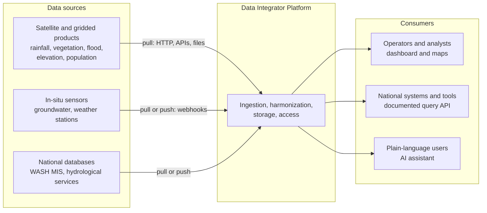
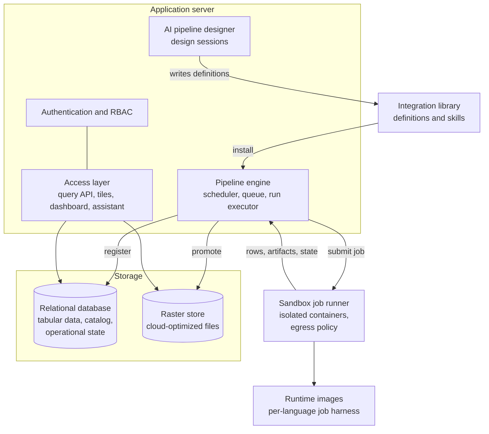
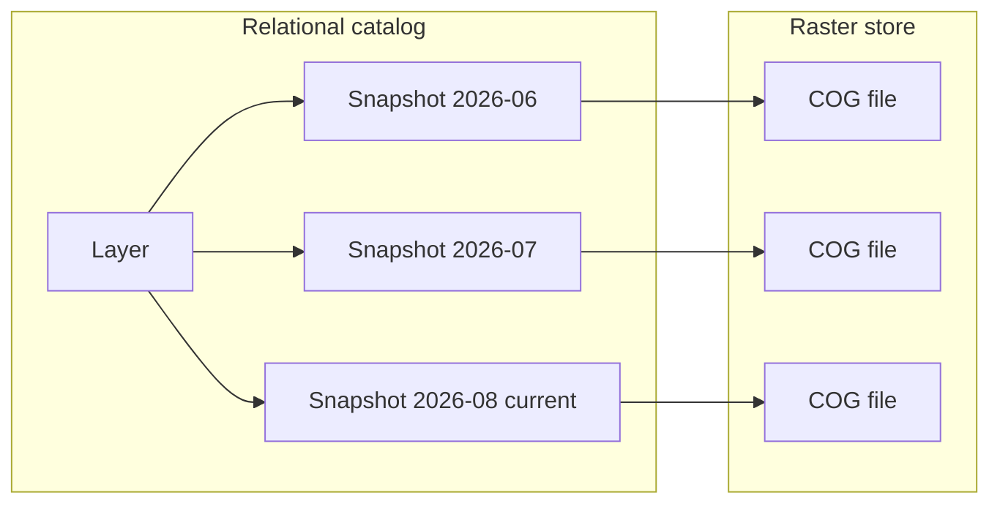
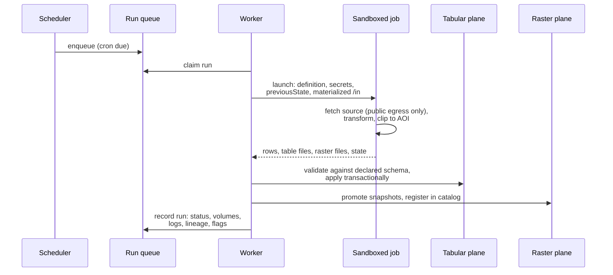

# Data Integrator System Architecture

This document defines the architecture of the Open Source Data Integrator
Platform: a self-hosted system that ingests multi-source water and climate
data, harmonizes it into standardized and interoperable formats, and exposes
it through a documented query interface, a dashboard, and an optional AI
assistant. An agentic AI capability designs, tests, and maintains the
ingestion pipelines themselves.

The architecture is modular, standards-based, and technology-agnostic. It
specifies components by their responsibilities and contracts so that any
vendor can implement it with their own technology choices. Section 7 maps
the architecture onto the reference implementation (mWater Pathfinder, the
proof of concept developed under the same terms of reference and published
under the same open-source license); nothing elsewhere in the document
depends on those choices, and no part of the architecture requires that
implementation.

Companion documents:

- *Interoperability and Standards Mapping*: the standards each interface
  conforms to and the integration paths for national systems.
- *Integration Library Specification*: the machine-readable definition format
  for data sources, an independently reusable deliverable.

## 1. Design principles

1. **Self-hosted and open source.** The platform deploys from a public
   repository onto infrastructure the operator controls. No vendor account,
   license, or hosted service is required to run any core function.
2. **Configuration-driven.** Connecting a new data source is a new
   integration definition, not a change to the platform. Definitions are
   machine-readable data, portable across implementations.
3. **The job contract is the architecture.** Ingestion code runs in sandboxed
   jobs against a small, language-agnostic contract. Programming languages
   are interchangeable runtime images that implement the same contract.
4. **Two data planes.** Tabular data lives in a relational database with
   spatial types. Raster data lives as cloud-optimized files in a store with
   a relational catalog. Each plane uses the storage suited to it.
5. **Bounded work.** Every heavy operation is clipped to a configured area of
   interest. A deployment for one country downloads and processes that
   country's window of global datasets, which is what makes low-cost,
   low-connectivity deployments viable.
6. **AI is optional and replaceable.** Ingestion, storage, scheduling, and
   the query interface are fully functional with no AI model configured. The
   model behind the agentic capabilities is a configurable dependency with a
   documented minimum capability profile, satisfiable by self-hostable
   open-weights models.
7. **Provenance everywhere.** Every stored datum traces to the run that
   produced it, the definition version that ran, the inputs it consumed, and
   the area of interest it covered.

## 2. System context



The platform sits between heterogeneous data sources and three kinds of
consumers. Sources are reached two ways: pipelines pull from APIs, file
servers, and satellite product archives on a schedule, and push-capable
sources (typically sensor networks) deliver events to per-integration webhook
endpoints. Consumers read one harmonized store through role-gated interfaces.

A deployment serves one institution (a ministry, a country office). Multiple
countries are multiple deployments of the same software, each configured with
its own area of interest, sources, and users.

## 3. Component architecture



| Component | Responsibility |
|---|---|
| Integration library | Machine-readable definitions of data sources and the know-how to ingest them |
| Pipeline engine | Triggers, queues, executes, and records ingestion runs |
| Sandbox job runner | Executes integration code in isolated containers under resource limits and an egress policy |
| Runtime images | Map the language-agnostic job contract onto each supported language |
| Harmonization | Normalizes units, projections, time, and codings; validates results |
| Tabular plane | Relational destination tables with spatial types |
| Raster plane | Immutable cloud-optimized raster snapshots with a relational catalog |
| Access layer | Documented query API, map tiles, dashboard, analytical dashboards, AI assistant |
| AI pipeline designer | Agentic design, testing, and maintenance of integrations |
| Security components | Accounts, roles, secrets, sandbox isolation, read-only analytical SQL |

### 3.1 Integration definitions and library

An integration is described entirely by one machine-readable definition:

```
{ id, name, source, trigger, secrets, aoi, inputs, runtime, limits,
  destinations, validation, code, contract }
```

- `source` documents the upstream provider, license, and documentation URLs.
- `trigger` declares when the integration runs: a cron schedule, webhook
  events, or both. Webhook triggers may declare a batch window so
  high-frequency feeds are processed in batches rather than per event.
- `secrets` names the credentials the code needs. Values are never part of
  the definition: the deployment stores them with the integration (write-only,
  encrypted), and importing a definition prompts for them.
- `aoi` is the area of interest. It is tri-state: an explicit bounding box
  clips ingestion to it, an explicit null means the source's full extent, and
  omission inherits the deployment's default AOI at run time. The box is a
  download window. An area that names countries is also resolved to a
  boundary shape (the countries' land outlines from a bundled public-domain
  boundary dataset, inland water removed, cut to the box), and that shape is
  what statistics "of the country" and map drawing clip to.
- `inputs` references catalog layers and tables that this integration
  consumes, which is how derived analytics (drought indices, exposure
  statistics) are expressed as ordinary integrations.
- `destinations` declare the outputs: tabular schemas (columns, types,
  merge behavior) and raster layers (bands, units, nodata, rendering).
- `validation` declares quality rules (value ranges, expected cadence) that
  the platform evaluates on every run.
- `code` is one self-contained file in the declared `runtime` language.
  Work that outgrows one file is split into chained integrations connected
  through `inputs`, keeping every unit independently testable.

The library is a versioned directory of these definitions plus *skills*:
prose documents capturing per-source and per-technique know-how that the AI
designer loads on demand. The library is deliberately independent of the
platform: it is a common reference any implementation can consume.

Installing a library entry copies the definition into the deployment, where
it becomes the integration's single specification. Every subsequent change,
whether made by an operator or the AI designer, archives a new attributed
version. Updating from the library preserves the deployment-owned fields
(AOI, trigger, limits). This gives full change history without a separate
override layer.

### 3.2 Pipeline engine

The pipeline engine turns definitions into recorded runs.

- **Triggers.** A scheduler evaluates cron triggers once per minute (UTC). A
  public webhook receiver accepts pushed events on per-integration
  capability URLs, buffers the payloads, and enqueues a run, immediately or
  at the end of the declared batch window. Operators can run any integration
  manually. The AI designer enqueues test runs with priority.
- **Queue.** Runs queue in the database. Any number of workers drain the
  queue; database constraints guarantee at most one queued and one running
  run per integration, so runs are serialized per integration and burst
  triggers coalesce instead of stacking.
- **Incremental state.** Each successful run may return a state object that
  the next run receives. This is the only authoritative incremental state,
  and it is what makes ingestion resumable: after connectivity loss or
  downtime, the next run continues from the recorded state and backfills the
  gap.
- **Inputs.** Before launching a job, the engine resolves the definition's
  `inputs` to concrete snapshot and table versions and materializes them
  read-only inside the job. The resolved versions are recorded on the run,
  which is the lineage record for derived data. Runs whose resolved inputs
  are unchanged since the last success are skipped and flagged as such.
- **Records.** Every run stores its trigger, status, timing, data volumes,
  logs, error, definition version, resolved inputs, and the AOI it executed
  with. Validation violations and freshness lapses flag the run.
- **Liveness.** Running jobs heart-beat; a reaper fails runs whose worker
  died, so the queue never wedges.

### 3.3 Sandbox executor and the job contract

All integration code executes in sandboxed, resource-limited containers. The
platform never runs source-specific code in its own process.

The job contract is language-agnostic:

- **stdin**: `{ definition, secrets, previousState, webhookData?, params }`.
  `webhookData` is every pending webhook event, oldest first.
- **stdout**: `{ data?, tables?, rasters?, state? }`. Small tabular results
  return inline in `data`; larger tables are written as files and referenced
  in `tables[]`; raster outputs are files referenced in `rasters[]`.
- **stderr**: logs, captured and stored with the run.
- **`/in`** (read-only): materialized inputs with a manifest describing them.
- **`/work`**: a persistent per-integration workspace with cache semantics.
  It may be wiped at any time; correctness never depends on it. A disk quota
  is part of the job limits.
- **`/out`**: where the job writes its file artifacts.
- Nonzero exit fails the run; the stderr tail becomes the error message.

A per-language harness in each runtime image maps this contract onto a single
entrypoint function, so integration code is a plain module with no
platform-specific imports. Two runtime images are specified, one for
JavaScript and one for Python, the latter carrying an open geospatial stack
(raster, array, and vector libraries) that the library's integrations rely
on; further languages are additional images implementing the same harness
contract, verified by shared contract tests.

Jobs never touch the database or the raster store. The engine validates
tabular output against the declared destination schema and applies it
transactionally (a file-based table load has the same atomicity as inline
rows), and registers raster artifacts in the catalog. This is the boundary
that makes sandboxing meaningful: code inside the sandbox produces data,
and the platform outside the sandbox decides what to do with it.

Sandbox properties (see also section 5):

- Rootless containers with a second isolation layer intercepting syscalls.
- Read-only root filesystem, no capabilities, per-job CPU, memory, disk, and
  wall-clock limits, declared in the definition and capped by the deployment.
- Egress to the public internet only: private, link-local, and cloud
  metadata address ranges are blocked at the network layer inside the job's
  network namespace.
- Curated libraries are baked into the runtime images and pinned; jobs
  cannot install packages at run time.

### 3.4 Harmonization

Harmonization is split between declaration and enforcement. Definitions
declare the target formats; the platform enforces them at registration time,
so nothing enters the store unharmonized.

- **Units.** Bands and columns declare their units; values are stored in the
  declared units.
- **Projections.** Tabular geometries are stored in a single geographic CRS
  (WGS 84). Rasters keep their native grid and CRS to avoid resampling loss
  at ingest; the catalog records the CRS per snapshot, and map tiles are
  warped to the web projection at render time.
- **Boundaries.** Pixels of a clipped raster extend past the coastline and
  the border, so the deployment's area of interest is materialized as a
  land-only shape with recorded provenance (dataset and version). Area
  statistics weight coarse pixels by the part inside the shape, fine pixels
  by their area at their latitude, and report the share of the shape covered
  by valid data; map tiles are cut to it.
- **Time.** All timestamps are UTC. Raster snapshots carry an instant or an
  explicit time range; time-step normalization is declared in the
  definition.
- **Missing data.** Bands declare their nodata convention, and analytical
  interfaces respect it, so sentinels never contaminate statistics.
- **Codings.** Categorical recoding to standard vocabularies is part of the
  integration's transformation logic, expressed in code against the declared
  destination schema.
- **Validation.** Declared range and cadence rules are evaluated on every
  run; violations flag the run and surface in the dashboard, and data
  freshness is measured against the declared cadence.

### 3.5 Storage layers

**Tabular plane.** One relational table per declared tabular destination,
with spatial columns where declared. Destination tables are ordinary tables
in an isolated schema: any tool that speaks to the database can read them,
which is itself an interoperability path.

**Raster plane.** Raster data stays out of the database. Snapshots are
cloud-optimized GeoTIFF files in a store that is a local filesystem by
default (low-connectivity deployments) or an object store with HTTP range
reads, with an identical layout either way. A relational catalog records layers,
snapshots, and bands with footprints, timestamps, units, and rendering hints.

- Snapshots are immutable once promoted. Time-series layers retain history
  as queryable snapshots; current-only layers prune superseded ones.
- Data and tile URLs pin the snapshot id, so caches never serve stale data.
- Promoted snapshots are additionally registered as out-of-database rasters
  in the analytical SQL surface, so SQL can sample raster values under
  vector features and compute zonal statistics without pixels entering the
  database. This registration is best-effort: every other function works
  without it.
- The area-of-interest shape is a row of the same surface, with a function
  returning area-weighted statistics of any layer over it (mean, share
  meeting a condition, coverage, cell size, snapshot used, boundary
  provenance), so agents and analysts never approximate a country by its
  envelope.
- Raw source files are working data with short, per-integration retention;
  the store holds harmonized products, not archives of upstream downloads.



### 3.6 Access layer

- **Query API.** The contractual programmatic interface: token-authenticated
  reads over every destination table (filtered, paginated, in JSON, CSV, and
  GeoJSON) and the raster catalog with direct snapshot downloads. The API is
  described by a machine-readable specification served by the platform.
  Fully functional with no AI configured.
- **Map tiles.** Rendered raster tiles with snapshot-pinned, long-cacheable
  URLs, styled by the rendering declarations in the definition and clipped
  to the owning integration's area-of-interest shape (a query parameter
  draws the full extent instead).
- **Dashboard.** A web application covering the operator loop: data catalog,
  integration management, run history with logs and lineage, data preview,
  map views with time navigation, user management, and deployment settings.
  It uses the same HTTP interfaces the API exposes.
- **Analytical dashboards.** Purpose-built dashboards designed by the AI
  capability: parameterized SQL frozen at design time, rendered by a fixed
  component kit in a sandboxed frame. Because the SQL is frozen and runs
  under the read-only analytical role, viewing a dashboard requires no AI.
- **AI assistant.** Conversational access for non-technical users: questions
  in plain language are answered through the same query API, with results
  shown as tables, charts, and maps, and the generated query available for
  inspection.

### 3.7 AI pipeline designer

The designer is an agentic loop that builds and maintains integrations
through the same interfaces a human developer would use:

- Tools to inspect sources, edit the definition and code, manage
  destinations, submit sandboxed test runs, stream their logs, and read
  library skills.
- Test runs execute against a small AOI window to keep the loop fast, and
  run in a session-scoped scratch area: draft schemas and preview layers are
  isolated from production data, so designing or editing a live integration
  is safe until the operator accepts the result.
- Certification: a design can only be finished after a successful cold run
  of the final code, in a fresh workspace with no incremental state, so a
  warm cache cannot fake a pass.
- Sessions support operator steering mid-run and a graceful stop, and every
  accepted design archives a new attributed definition version.

The designer, the dashboard-design agent, and the assistant share one model
provider abstraction. The provider is configured at deployment with a
documented minimum capability profile (reliable instruction following,
structured output, tool use, agentic coding); any model meeting the profile
works, including self-hosted open-weights models. With no model configured,
the platform runs every non-AI function normally.

## 4. Data flows

### 4.1 Scheduled ingestion



### 4.2 Webhook ingestion

Push sources deliver JSON events to the integration's capability URL. The
receiver buffers each event and enqueues a run, immediately or at the end of
the integration's batch window; every buffered event rides in the next run's
`webhookData`, and events received while the integration is paused wait for
it to resume. Consumed events are stamped with the run that processed them,
extending lineage to individual pushed readings.

### 4.3 Derived integrations

A derived integration declares upstream layers and tables as `inputs`. At
launch the engine resolves those inputs to concrete snapshot versions,
materializes them read-only in the job, and records the resolved versions on
the run. Chains of integrations (ingest rainfall, ingest population, compute
population-weighted rainfall) are therefore reproducible: each link records
exactly which upstream versions it consumed, and unchanged inputs skip the
run.

### 4.4 Access

Interactive users, national systems, and the AI assistant all read through
the access layer against the same stores. Analytical SQL (dashboards, the
assistant, raster-vector statistics) executes under a read-only role that can
see destination data and the catalog and nothing else.

## 5. Security architecture

The deployment model is single-institution and self-hosted: the operator owns
the host, network, and database. The platform's security components defend
the data and the host against untrusted inputs, misbehaving integration code
(including AI-written code), and credential leakage.

| Boundary | Mechanism |
|---|---|
| Accounts | Local accounts, salted memory-hard password hashing, lockout on repeated failure, no default credentials |
| Sessions and tokens | Cookie sessions for the dashboard; personal access tokens for the API; both revocable |
| Authorization | Admin, editor, and viewer roles enforced server-side on every route |
| Integration code | Rootless containers plus a syscall-isolation layer, read-only rootfs, no capabilities, resource limits |
| Network egress | Public internet only from jobs; private, link-local, and metadata ranges blocked in the job's network namespace |
| Secrets | Stored per integration and encrypted at rest with a deployment key; injected via stdin only into the owning integration's runs, so an imported definition cannot receive another integration's credential; never in images, environment, or definitions |
| Webhooks | Unguessable per-integration capability URLs, JSON-only with size caps, admin-rotatable |
| Analytical SQL | Frozen at design time where applicable, always executed under a read-only role scoped to destination data |
| Transport | TLS terminated by the deployer's reverse proxy, with secure-cookie behavior keyed to forwarded protocol |

The platform stores environmental and infrastructure data; personal data is
out of scope by design.

## 6. Deployment architecture

A deployment is one application server process (or several, sharing the
database), one relational database with spatial extensions, a raster store
path or bucket, and a container runtime for the sandbox. All components run
on commodity Linux on-premises or in any cloud; there is no external service
dependency.

Low-connectivity operation is a design constraint, not an afterthought:

- AOI clipping bounds download volumes to the deployment's geography.
- Ingestion is resumable: state-driven incremental fetch backfills after
  outages, and runs fail cleanly on lost connectivity.
- The raster store defaults to the local filesystem, and the platform serves
  its own web assets, so a deployment has no runtime dependency on external
  networks beyond reaching its data sources.
- AI features degrade gracefully to absent when no model (or no
  connectivity to one) is available.

## 7. Technology neutrality and the reference implementation

Every component above is specified by contract: the definition format, the
job payload and mount layout, the queue semantics, the storage split, the
API surface, and the security boundaries. The reference implementation,
mWater Pathfinder, realizes them as follows. This table is descriptive, not
normative: it records one set of choices that satisfies the contracts.

| Architecture component | Reference implementation |
|---|---|
| Application server | Node.js (TypeScript), single process serving API, dashboard, scheduler, and agents |
| Relational database | PostgreSQL with PostGIS |
| Raster store | Local filesystem (S3-compatible object storage optional); cloud-optimized GeoTIFF |
| Sandbox | podman (rootless) with gVisor syscall isolation; nftables egress policy |
| Runtime images | `node22` and `python3.12` OCI images with the geospatial stack in Python |
| Job queue | Database-backed queue with partial unique indexes for serialization |
| Query API | REST with OpenAPI description; JSON, CSV, GeoJSON |
| Tiles | XYZ raster tiles rendered from COGs via GDAL |
| Dashboard | React single-page application served by the platform |
| AI provider | Configurable; any model meeting the capability profile, including self-hosted open-weights models |
| License | Apache 2.0 throughout; CI license and SBOM checks |

A conforming alternative implementation could substitute any row of this
table (a JVM server, a different container sandbox, an object store) without
changing the integration library, the job contract, or the client-facing
interfaces, which is the property competitive procurement requires.

## 8. Extensibility

- **New data sources** are new library definitions, authorable by the AI
  designer with a human in the loop, shareable across deployments through
  the library or directly: any integration exports as a single definition
  file that another deployment imports, arriving paused for review with the
  importer's area of interest applying.
- **New derived analytics** are ordinary integrations over `inputs`.
- **New languages** are new runtime images implementing the harness
  contract.
- **New countries** are new deployments: set the default AOI, install the
  relevant library entries, create accounts.
- **National-system integration** happens over the query API, file exports,
  the analytical SQL surface, and map tiles; the companion standards mapping
  enumerates the concrete conventions.
